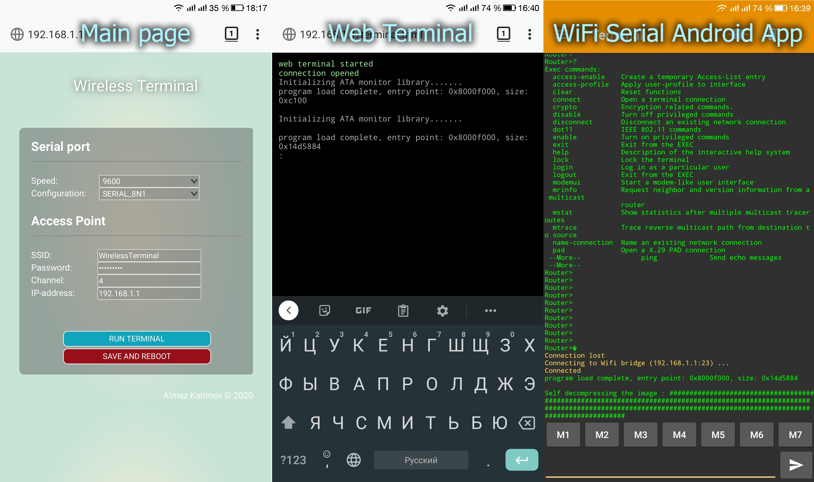

=================================================================================================
Wireless Terminal - simple, configurable with web, wifi to uart bridge, using esp8266
=================================================================================================

Code written using **Visual Studio Code** and **PlatformIO** plugin.
At startup, the controller creates a **WirelessTerminal** access point with the password **123456789**.
Configurable with web interface (**192.168.4.1** address by default).
To connect to a device via **uart** (or **rs232** via a converter),
open a **TCP terminal** (eg telnet client) and connect to the controller on port **23**
eg: ::
    telnet 192.168.4.1

Or start terminal emulator on web-browser: ::
    192.168.4.1/terminal.html

The emulator is implemented using the **jQuery Terminal Emulator**: https://terminal.jcubic.pl/

library

=================================================================================================
Прозрачный настраиваемый мост wifi-uart, со встроенным эмулятором терминала
=================================================================================================

Прошивка написана в **Visual Studio Code** с использованием **PlatformIO**.
Настройка осуществляется с помощью web интерфейса.
При старте, контроллер создаёт точку доступа **WirelessTerminal** с паролем **123456789**.
Для настройки следует открыть в браузере адрес **192.168.4.1** (по умолчанию).
Для соединения с устройством через **uart** (или **rs232** через преобразователь),
следует открыть **TCP терминал** (telnet клиент) и подключится к контроллеру через порт **23**
например: ::
    telnet 192.168.4.1

Так-же возможен запуск эмулятора терминала прямо из браузера благодаря библиотеке 
**jQuery Terminal Emulator**: https://terminal.jcubic.pl/

Для этого достаточно перейти по ссылке: ::
    192.168.4.1/terminal.html

Screenshots
-----------

Wemos D1 Mini rs232 shield
==========================
Для сборки законченного устройства, разработан шилд для **wemos d1 mini**,
который преобразует **uart** микроконтроллера в физический интерфейс **rs232** с помощью
микросхемы **max3232**.
**Схема и плата**: https://easyeda.com/clericJ/wemos-d1mini-rs232shield

Оптимальным выбором для отладочной платы с **esp8266** будет любая плата с автономным
питанием от аккумулятора. Например  **TTGO T-OI ESP8266**: https://aliexpress.ru/item/4000429110448.html?spm=a2g0s.9042311.0.0.2b5133edVjkrSm&_ga=2.179155172.1130155723.1595170840-791673895.1587745386

.. image:: img/wemos-rs232-shield.png
    :scale: 50%
